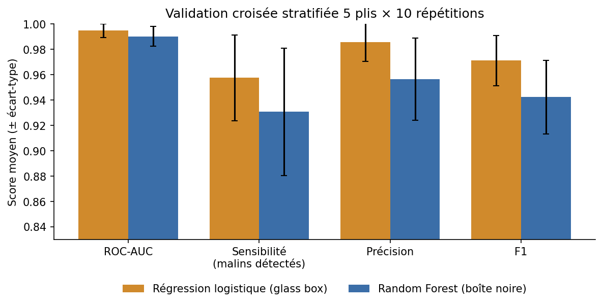
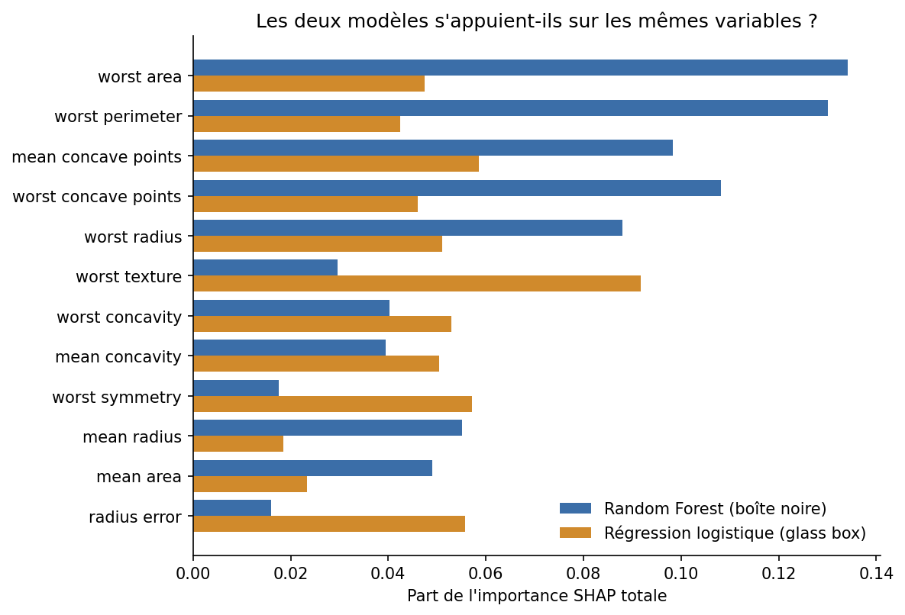
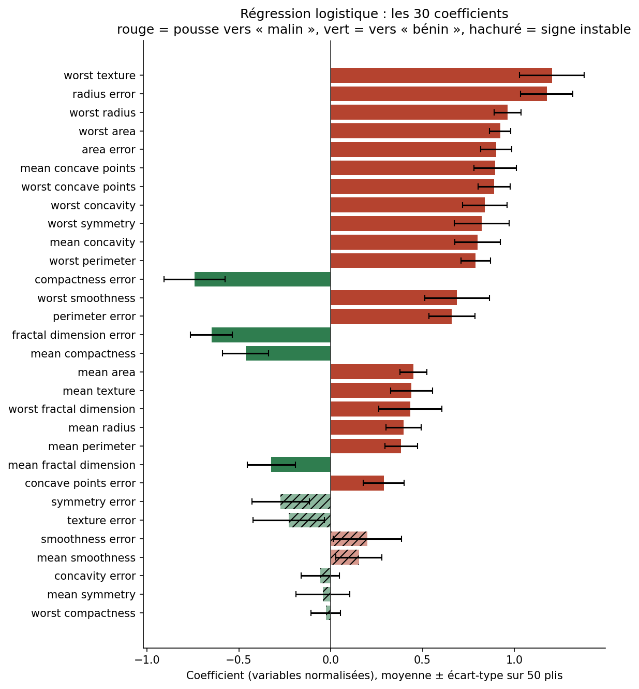
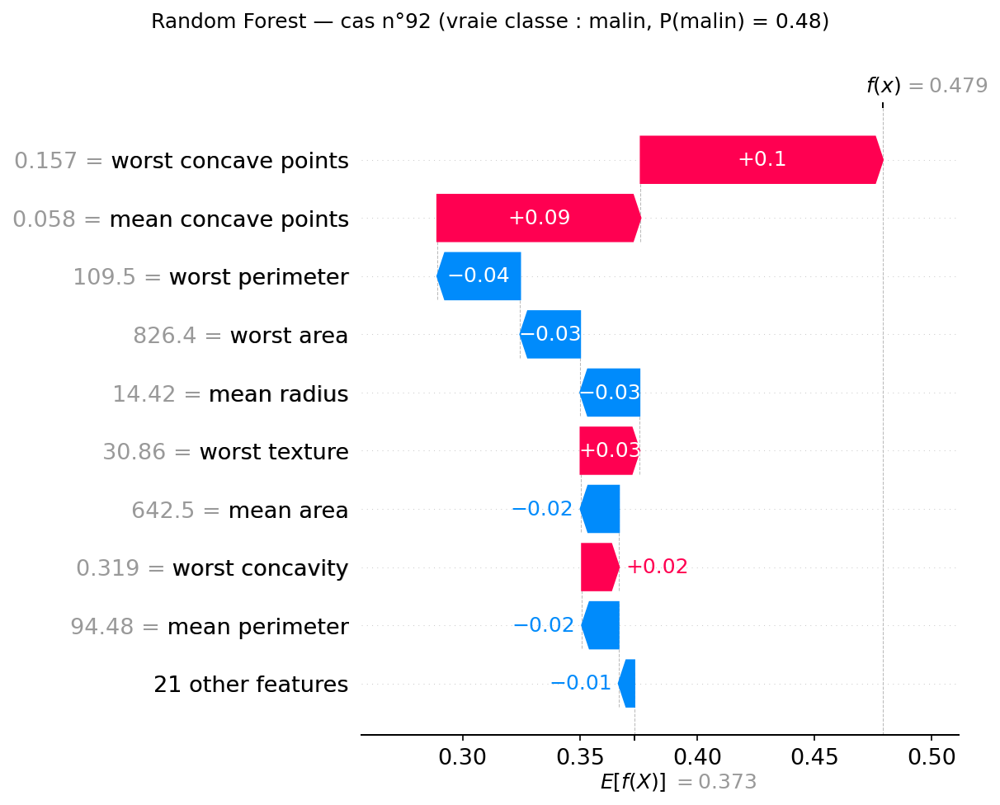
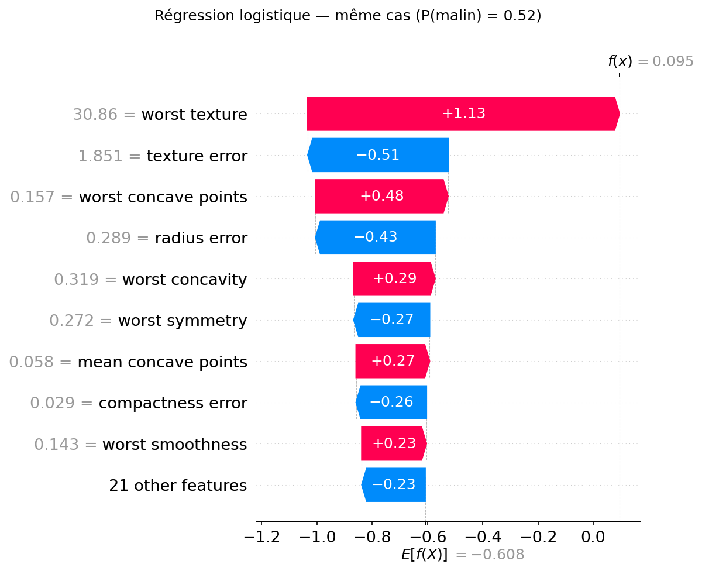

# Interprétabilité — boîte noire expliquée par SHAP ou modèle lisible par construction ?

Avant de mettre un modèle en production, une entreprise doit souvent pouvoir justifier ses décisions à un client, un auditeur ou un médecin. Ce projet compare deux façons d'y arriver sur un cas d'aide au diagnostic :

- un **Random Forest**, performant mais opaque, expliqué *après coup* avec **SHAP** ;
- une **régression logistique**, dont les coefficients se lisent directement (*glass box*).

Données : *Wisconsin Breast Cancer* (569 tumeurs, 30 mesures cellulaires, intégré à scikit-learn, aucune donnée patient réelle). La classe positive est la tumeur **maligne**.

## Résultats

### 1. La régression logistique fait jeu égal avec le Random Forest

Validation croisée stratifiée 5 plis × 10 répétitions (50 évaluations par modèle) :

| | ROC-AUC | Sensibilité (malins détectés) | Précision | F1 |
|---|---|---|---|---|
| Régression logistique | **0,995** ± 0,005 | **0,958** ± 0,034 | **0,986** ± 0,015 | **0,971** ± 0,020 |
| Random Forest | 0,990 ± 0,008 | 0,931 ± 0,050 | 0,956 ± 0,033 | 0,942 ± 0,029 |

La régression logistique a un meilleur ROC-AUC sur 70 % des plis, mais l'écart n'est pas statistiquement significatif (test de Student corrigé de Nadeau et Bengio : p = 0,28 sur le ROC-AUC, p = 0,07 sur le F1). Conclusion : sur ces données, le modèle opaque n'apporte **aucun gain de performance** qui justifierait de renoncer à l'interprétabilité.



### 2. Le seuil de 0,5 manque des tumeurs malignes

Sur le jeu de test (143 cas, dont 53 malins), au seuil par défaut de 0,5 :

- le Random Forest **manque 6 tumeurs malignes** ;
- la régression logistique en manque 4.

Un faux négatif (cancer non détecté) coûte bien plus cher qu'un faux positif (examen complémentaire). Le seuil est donc réglé sur les seules données d'entraînement pour viser 97 % de sensibilité. Résultat sur le test :

| | Seuil | Faux négatifs | Faux positifs |
|---|---|---|---|
| Random Forest | 0,26 | 6 → **3** | 0 → 4 |
| Régression logistique | 0,31 | 4 → **2** | 1 → 1 |

### 3. Deux modèles aussi précis l'un que l'autre ne donnent pas la même explication

Pour chaque modèle, SHAP indique quelles variables pèsent dans la décision :

- **Random Forest** : la taille de la tumeur domine (`worst area`, `worst perimeter`, `worst radius`) ;
- **Régression logistique** : la texture et la forme arrivent en tête (`worst texture`, `mean concave points`, `worst symmetry`).

Les deux classements ne sont que modérément corrélés (Spearman 0,53), et 6 variables sur 10 sont communes à leurs deux top 10.



La cause principale vient des données : **21 paires de variables sont corrélées à plus de 0,9**. Par exemple, le rayon et le périmètre moyens sont corrélés à 0,998. Quand deux variables portent la même information, chaque modèle répartit le crédit entre elles à sa façon.

**À retenir** : SHAP explique *le modèle*, pas le phénomène médical. Une explication SHAP ne doit pas être présentée comme « la cause » d'un diagnostic.

### 4. Même les coefficients « lisibles » demandent des précautions

Sur les 50 plis de validation croisée, **7 coefficients sur 30 changent de signe** d'un entraînement à l'autre : le sens de leur effet dépend de l'échantillon (par exemple `mean symmetry`, dont le signe ne se maintient que dans 58 % des plis). Seuls les coefficients forts et stables peuvent être interprétés.



### 5. Expliquer un cas précis

Le script choisit automatiquement le cas le plus instructif : ici, une tumeur maligne sur laquelle les deux modèles ne sont pas d'accord.

- **Random Forest** : P(malin) = 0,48, donc tumeur manquée au seuil 0,5 ;
- **Régression logistique** : P(malin) = 0,52, donc tumeur détectée.

Les graphiques *waterfall* montrent, variable par variable, ce qui a fait pencher chaque modèle.

| Random Forest | Régression logistique |
|---|---|
|  |  |

## Lancer le projet

```bash
pip install -r requirements.txt
python -m interpretabilite                 # environ 40 s
python -m interpretabilite --repeats 3     # validation croisée plus courte
python -m pytest                           # 16 tests
```

Tout est enregistré dans `outputs/` : `resultats.json` (tous les chiffres ci-dessus) et 6 graphiques.

## Choix techniques

- **Pas de fuite de données** : la normalisation est dans un `Pipeline` scikit-learn, recalculée sur chaque pli d'entraînement. Le seuil de décision est fixé sans jamais regarder le jeu de test.
- **Comparaison statistique adaptée** : en validation croisée répétée, les plis partagent des données d'entraînement. Un test de Student classique est alors beaucoup trop optimiste, d'où la correction de Nadeau et Bengio.
- **Explications vérifiées** : les tests contrôlent que, pour chaque cas, la somme des contributions SHAP redonne exactement la sortie du modèle (probabilité pour le Random Forest, log-odds pour la régression logistique).
- **Comparaison d'explications sur des échelles différentes** : les valeurs SHAP du Random Forest sont en probabilité, celles de la régression logistique en log-odds. Les deux modèles sont donc comparés sur le classement et la part d'importance de chaque variable, pas sur les valeurs brutes.

## Structure

```
interpretabilite/
  data.py          chargement, classe positive = malin, découpage stratifié
  models.py        Random Forest et pipeline normalisation + régression logistique
  evaluation.py    validation croisée répétée, test corrigé, seuil, stabilité des coefficients
  explain.py       SHAP (TreeExplainer, LinearExplainer), cohérence des explications, choix du cas
  plots.py         graphiques
  __main__.py      pipeline complet et rapport JSON
tests/             16 tests pytest
outputs/           résultats et graphiques générés
```

## Limites

- Petit jeu de données (569 cas) issu d'un seul centre : les chiffres ne se transposent pas tels quels à une population réelle.
- Une piste pour stabiliser les explications : regrouper les variables corrélées (taille, forme, texture) avant l'entraînement, ou utiliser une régularisation L1 qui en sélectionne une par groupe.

## Stack technique

Python · scikit-learn · SHAP · SciPy · pandas · matplotlib · pytest
